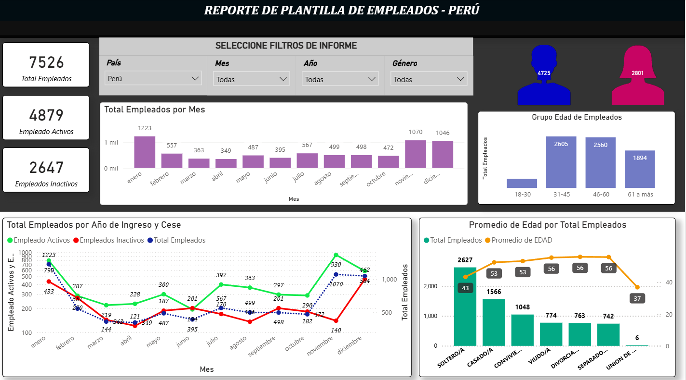
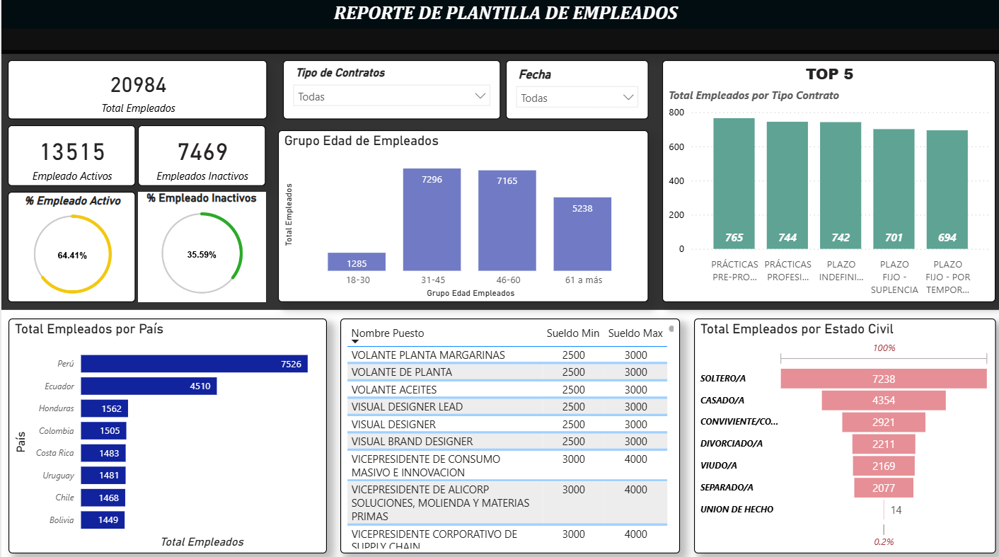

# Reporte de Plantilla de Empleados – Perú

Dashboard interactivo en Power BI para el análisis de plantilla de personal: distribución de empleados activos e inactivos.

## Contexto del proyecto

Este dashboard fue diseñado para responder preguntas típicas de un área de Recursos Humanos:

- ¿Cuál es la composición actual de la plantilla (activos vs. inactivos)?
- ¿Cómo varía la contratación y el cese de personal mes a mes?
- ¿Cuál es la distribución por grupo de edad, género y estado civil de los empleados?
- ¿Existen picos estacionales de rotación que deban anticiparse?

## Fuente de datos

> ⚠️ *Nota: los datos utilizados son simulados, generados con fines de práctica al portafolio. No corresponden a información confidencial de ninguna empresa.*

El dataset contiene ~7,500 registros de empleados con variables como: país, fecha de ingreso, fecha de cese (si aplica), género, fecha de nacimiento y estado civil.

## Proceso

1. **Transformación de datos (Power Query):** limpieza de tipos de dato, cálculo de edad a partir de fecha de nacimiento, creación de columna de estado (activo/inactivo) en base a la fecha de cese.
2. **Modelado:** relación entre la tabla de empleados y una tabla de calendario para permitir el análisis por mes y año.
3. **Medidas DAX:** total de empleados, empleados activos, empleados inactivos, promedio de edad, todas calculadas de forma dinámica según los filtros seleccionados.
4. **Visualización:** tarjetas KPI, gráfico de barras (altas por mes), gráfico de líneas combinado (activos/inactivos/total por año de ingreso y cese), gráfico de edad por estado civil, y segmentadores (país, mes, año, género).

## Insights clave

- La plantilla activa representa aproximadamente el 65% del total histórico de empleados registrados.
- Se observa un incremento notable de altas en noviembre y diciembre, lo que sugiere estacionalidad en la contratación.
- El grupo de edad de 31–45 años concentra la mayor cantidad de empleados, con una edad promedio general de 53 años entre el personal activo.
- La mayoría de empleados activos se concentra en los estados civiles "soltero/a" y "casado/a".

# Reporte de Plantilla de Empleados – Multi-país

Dashboard interactivo en Power BI para el análisis de plantilla de personal a nivel regional: distribución de empleados activos e inactivos, tipo de contrato y estructura salarial por puesto.

## Contexto del proyecto

Mientras que la primera versión se enfocaba únicamente en Perú, este dashboard responde preguntas a nivel regional para un área de Recursos Humanos:

- ¿Cómo se distribuye la plantilla total entre los distintos países?
- ¿Qué proporción de empleados está activa frente a inactiva?
- ¿Cuáles son los tipos de contrato más frecuentes?
- ¿Cuál es el rango salarial (mínimo/máximo) por puesto?
- ¿Cómo se compone la plantilla por grupo de edad y estado civil?

## Fuente de datos

> ⚠️ *Nota: los datos utilizados son simulados generado con fines de práctica al portafolio. No corresponden a información confidencial de ninguna empresa.*

El dataset contiene más de 20,000 registros de empleados de 8 países (Perú, Ecuador, Honduras, Colombia, Costa Rica, Uruguay, Chile, Bolivia), con variables como: país, tipo de contrato, puesto, rango salarial, fecha de ingreso/cese, edad y estado civil.

## Proceso

1. **Transformación de datos (Power Query):** consolidación de la plantilla por país, limpieza de campos de puesto y rango salarial, cálculo de estado (activo/inactivo).
2. **Modelado:** relaciones entre la tabla de empleados, catálogo de puestos (con sueldo mín./máx.) y tipo de contrato.
3. **Medidas DAX:** total de empleados, % de activos/inactivos, ranking de tipos de contrato (Top 5), totales por grupo de edad y estado civil.
4. **Visualización:** tarjetas KPI, gráficos de anillo para porcentajes, ranking de barras horizontales por país, tabla de puestos con rango salarial, y gráfico de embudo para estado civil.
5. **Navegación:** el archivo incluye dos páginas de reporte ("Reporte RRHH" general y "Reporte Perú" con foco local), permitiendo pasar de una vista regional a un detalle por país.

## Insights clave

- Perú concentra la mayor cantidad de empleados (7,526) entre los países analizados, seguido de Ecuador (4,510).
- El 64.4% de la plantilla total se encuentra activa frente a un 35.6% inactiva.
- Los contratos de prácticas (pre-profesionales y profesionales) están entre los tipos de contrato más frecuentes, junto con contratos indefinidos y plazo fijo.
- La mayoría de los empleados se concentra en los grupos de edad 31-45 y 46-60 años.
- "Soltero/a" es el estado civil predominante, seguido de "casado/a"; los casos de "unión de hecho" son marginales (0.2%).

## Cómo verlo

- **Archivo Power BI:** descarga [`Plantilla-empleados-BI.pbix`](./Plantilla-empleados-BI.pbix) y ábrelo con Power BI Desktop.

